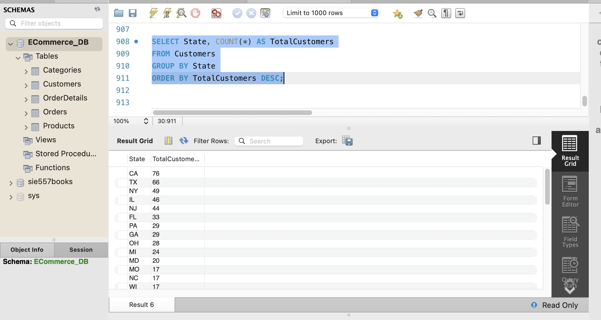

# 🛒 E-Commerce Database (MySQL)

## Overview

This project demonstrates the design and implementation of a relational database using **MySQL**. The database models a simple e-commerce system with customers, products, categories, orders, and order details.

This project showcases fundamental database design concepts, SQL programming, relational data modeling, and data retrieval techniques.

---

## Technologies

- MySQL 8
- MySQL Workbench
- SQL
- Git
- GitHub

---

## Project Features

- Designed a relational database for an e-commerce system.
- Created database tables using SQL Data Definition Language (DDL).
- Established relationships using primary and foreign keys.
- Imported customer and business data into the database.
- Executed SQL queries to retrieve, filter, sort, and summarize data.
- Managed the project using GitHub.

---

## Database Tables

- Customers
- Categories
- Products
- Orders
- OrderDetails

---

## Skills Demonstrated

- Relational Database Design
- SQL (DDL & DML)
- Primary Keys
- Foreign Keys
- Data Modeling
- Data Import
- Data Retrieval
- Filtering (`WHERE`)
- Sorting (`ORDER BY`)
- Grouping (`GROUP BY`)
- Aggregate Functions (`COUNT`)
- MySQL Workbench
- Git & GitHub

---

## Sample SQL Queries

This project includes sample SQL queries demonstrating:

- Data retrieval using `SELECT`
- Filtering records using `WHERE`
- Sorting results using `ORDER BY`
- Grouping data using `GROUP BY`
- Counting records using `COUNT`

See **sample_queries.sql** for example SQL queries.

---

## How to Run

1. Open MySQL Workbench.
2. Open `ECommerce_DB_MySQL.sql`.
3. Execute the SQL script.
4. The database and tables will be created automatically.
5. Run the queries in `sample_queries.sql` to explore the database.

---

## Screenshots

### Database Tables

### Customers Table

### Customer Distribution by State

---

## Future Improvements

- Add more advanced SQL queries
- Create an Entity Relationship (ER) Diagram
- Develop business reports and dashboards using Power BI
- Build an ETL pipeline using Python and Pandas
- Optimize database performance using indexes and views

---

## Author

**Dawit Kahsay**

- M.S. Data Science & Engineering Student
- B.S. in Computer Science
- U.S. Army Veteran
- Active Secret Security Clearance
