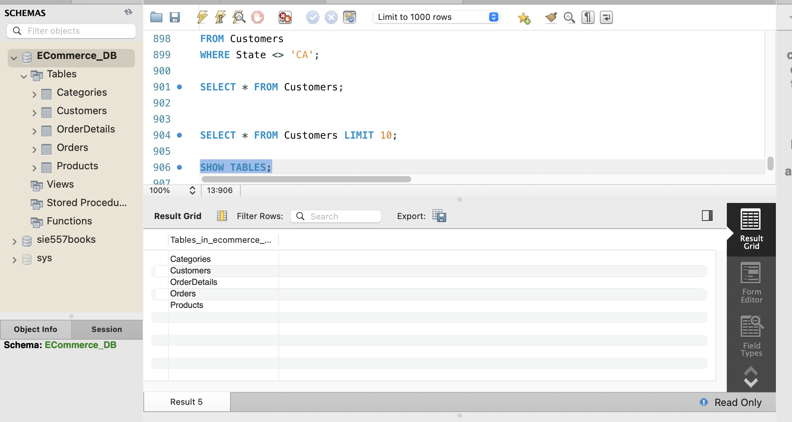
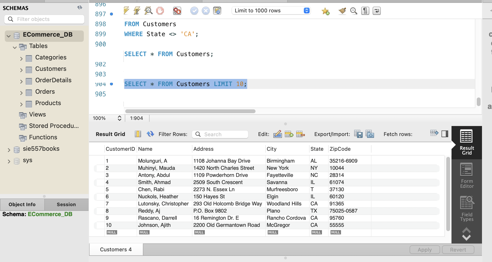

#  E-Commerce Database (MySQL)

## Overview

This project demonstrates the design and implementation of a relational database using MySQL. The database models a simple e-commerce system with customers, products, categories, orders, and order details.

## Technologies

- MySQL 8
- MySQL Workbench
- SQL

## Database Tables

- Customers
- Categories
- Products
- Orders
- OrderDetails

## Skills Demonstrated

- Database Design
- SQL (DDL & DML)
- Primary Keys
- Foreign Keys
- Relational Database Modeling
- Data Import
- MySQL Workbench

## Database Schema

- Customers
- Categories
- Products
- Orders
- OrderDetails

## How to Run

1. Open MySQL Workbench.
2. Open `ECommerce_DB_MySQL.sql`.
3. Execute the script.
4. The database and tables will be created automatically.

## Future Improvements

- Add sample business queries
- Create an ER diagram
- Build a Power BI dashboard
- Build an ETL pipeline using Python
- 
## Screenshots

### Database Tables

### Customers Table

### Customer Distribution by State

